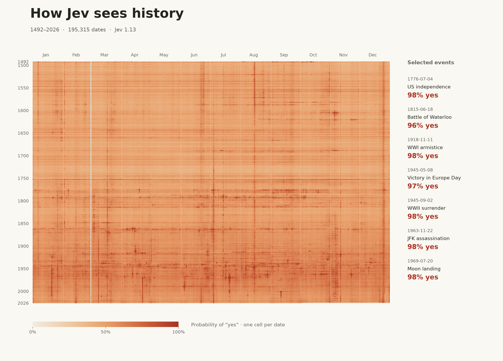

# How Jev sees history

**[Open the heatmap](https://not-stbenjam.github.io/historical-heatmap/)**



An independent judgment for every date from January 1, 1492 through October 2,
2026. Every request asks exactly:

> Did something historically significant happen on this date?

The only context is `{"date": "YYYY-MM-DD"}`. No event names, retrieved facts,
explanations, or extra significance criteria are supplied to the model.

The completed run contains **195,315 dates, with no missing results**. With 100
parallel workers capped at 400 requests/second, collection took **8 minutes 15
seconds**. Successful responses reported **$2.38713993** in total cost, using the
snapshot `typesafe/jev-1.13-20260917`. There are 517 dates with at least 90%
probability of yes. Six local tests cover calendar alignment, invalid responses,
rate-limit recovery, fatal errors, and resuming without repeated requests. The
stored probabilities were checked against every raw API response.

## View the experiment

Open `web/history.html` for a portable, interactive heatmap; it contains the
results and works offline. `web/heatmap.png` is a shareable static image.
`web/results.csv` contains the date, probability of yes, reported cost, input
tokens, and request latency. `data/history.sqlite` retains every raw API response
and experiment metadata locally; the database is excluded from Git. The complete
date probabilities and experiment metadata are included in `web/data.json` and
`web/summary.json`, and every evaluated date is available in the CSV.

To use the live page locally:

```sh
python3 -m http.server 8000 --directory web
```

## Reproduce or extend

Requires Python 3.11 or later.

```sh
python3 -m venv .venv
.venv/bin/pip install -r requirements.txt
.venv/bin/python collect.py --dates 1963-11-22 1969-07-20 --concurrency 2
.venv/bin/python collect.py --start 1492-01-01 --end 2026-10-02 --concurrency 100
.venv/bin/python render.py
```

The collector prompts for an API key with terminal echo disabled. You may also
provide `OPENROUTER_API_KEY` through your own environment. Keys are never stored
in project files, database responses, exports, or the browser.

Collection uses OpenRouter's `POST /api/alpha/decisions` with
`typesafe/jev-1.13` and a single `noul` question per request. Each saved raw response
records the actual dated model snapshot. The same database can be resumed without
repeating already saved dates. It refuses to mix a changed prompt or model into
an existing dataset. Results are committed at least every 100 successful dates
and every five seconds; at most the last uncommitted batch needs to be recollected
after a hard crash. A separate `data/status.json` tracks progress and cost.

By default, 100 workers run at a maximum of 400 requests/second, reusing HTTPS
connections. Temporary network/provider failures are retried with backoff, and
HTTP 429 applies a shared cooldown. Authentication, billing, request errors, or
exhausted retries stop the run; failures are never recorded as zero probabilities.
Run the same command again to resume. Only the date and question are sent to
OpenRouter. The supplied key is used solely for this experiment.

To extend back to AD 1, retaining saved dates:

```sh
.venv/bin/python collect.py --start 0001-01-01 --end 2026-10-02 --concurrency 100
.venv/bin/python render.py --start 0001-01-01 --end 2026-10-02
```

## Reading the map

One cell is one full date, with years running down and month/day running across.
All years use a 366-column leap-year template, so month boundaries align; February
29 in ordinary years has no cell value. Gray is a missing or nonexistent date.
Colors use the same fixed 0–1 scale at every zoom level. The value is Jev's reported
probability that the answer is **yes**, not an importance score or a verified
probability that a historical event happened.

The additional views use these same saved scores without making new API requests:

- **Highest-scoring years** ranks complete years by days scoring at least 90%, or
  by mean probability. Click a year to zoom the heatmap.
- **History over time** plots yearly means or decade means, weighted by evaluated
  days. Yearly and decade comparisons include only complete years, so partial
  2026 is excluded. The first and last decades can contain fewer than ten years.
  Hover or use arrow keys to select; click or press Enter to zoom.
- **Unusually significant dates** ranks each date by its probability minus the
  mean for that month/day in all other evaluated years. Lift is expressed in
  percentage points (pp), rather than as a probability. This highlights spikes
  above recurring calendar patterns without establishing historical importance.
- **Calendar fingerprints** averages each month/day across all evaluated years,
  including partial 2026. A leap-year layout aligns the calendar tiles; its
  weekdays are for layout only. February 29 averages only actual leap days.
  Select a tile to see its three highest-scoring dates. Date links search Google.

Dates are generated using the proleptic Gregorian calendar. Event annotations use
their commonly cited dates, without converting historical calendar conventions;
this matters for early dates such as Columbus's landing. No date convention is
specified in the model's context beyond its ISO date string. Modern events may
also have different dates depending on local time versus UTC.

`events.json` is a small, separately sourced reference overlay. It is loaded only
when rendering, never while querying. A matching label is not evidence that Jev
recognized that particular event. An unannotated high-scoring date is a model
judgment without an explanation; absence from the overlay does not mean nothing
happened. The map may expose cultural biases, memorization, uncertainty, and date
patterns as well as historical knowledge. This experiment does not establish
calibration or historical accuracy.

API reference: https://openrouter.ai/docs/guides/community/jev-tutorial

## Publish updates

GitHub Pages publishes the root of `gh-pages`. Source code and generated files
live on `main`; the `gh-pages` branch contains only the `web` directory contents.
After rendering and committing changes on `main`, publish with:

```sh
python3 publish.py
```

The script verifies `origin` before each push, publishes the committed `main:web`
tree, and preserves Pages deployment history. It requires Git and an authenticated
GitHub CLI; it uses normal pushes and refuses an unexpected destination.
